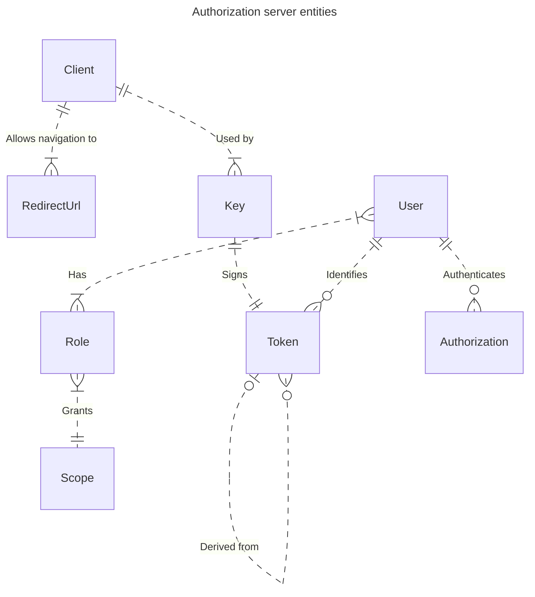

# Entity Relationship Diagrams

This diagram shows on a high level how different resources/entities are related to each other.

```mermaid
---
title: Authorization server entities
---

erDiagram
    Client one optionally to one or many RedirectUrl : "Allows navigation to"
    Client one optionally to one or many Key : "Used by"
    Key one optionally to one Token : "Signs"
    Token one or zero optionally to zero or more Token : "Derived from"
    User one or many optionally to one or many Role : "Has"
    User one optionally to zero or many Token : "Identifies"
    User one optionally to zero or many Authorization : "Authenticates"
    Role one or many optionally to one Scope : "Grants"
```
