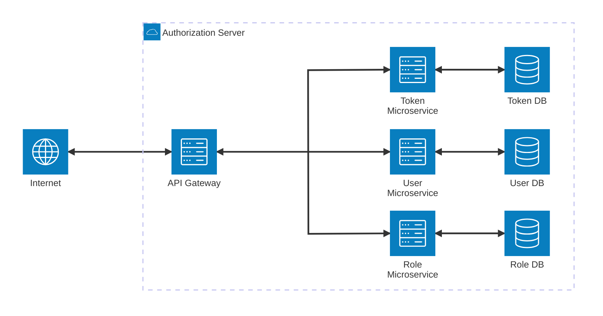

# Microservices Architecture

Below you'll see a diagram that'll try to explain how the microservices architecture is designed.

```mermaid
architecture-beta
    service internet(internet)[Internet]
    
    group authorization_server(cloud)[Authorization Server]
    
    service api_gateway(server)[API Gateway] in authorization_server
    service user_db(database)[User DB] in authorization_server
    service user_ms(server)[User Microservice] in authorization_server
    
    service token_db(database)[Token DB] in authorization_server
    service token_ms(server)[Token Microservice] in authorization_server
    
    service role_db(database)[Role DB] in authorization_server
    service role_ms(server)[Role Microservice] in authorization_server
    
    junction junction1 in authorization_server
    
    internet:R <--> L:api_gateway
    
    api_gateway:R <-- L:junction1
    junction1:R --> L:user_ms
    junction1:T --> L:token_ms
    junction1:B --> L:role_ms
    
    user_ms:R <--> L:user_db
    token_ms:R <--> L:token_db
    role_ms:R <--> L:role_db
```
